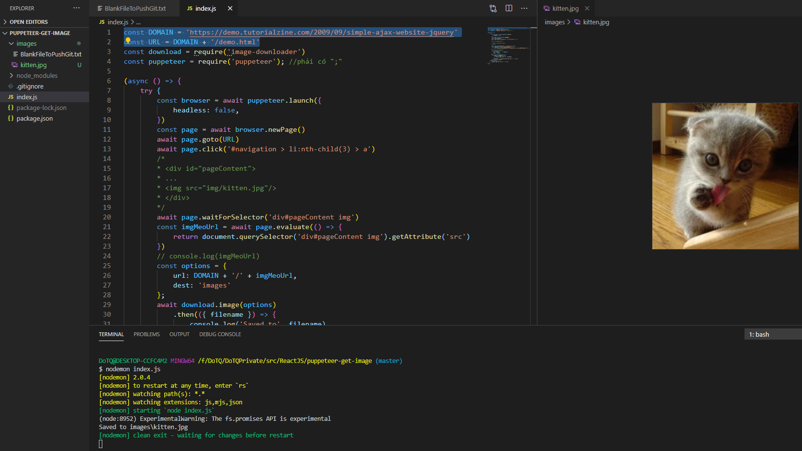

# puppeteer-get-image 🐳

## deploy local
1/ npm i 2/nodemon index

access to URL(https://demo.tutorialzine.com/2009/09/simple-ajax-website-jquery/demo.html) > download image file at #page3 into "images" folder

# POSTMAN request record(intercept)

1. chrome 확장 프로그램 - postman intercept 설치
2. postman desktop app 설치
3. (!!중요!!) bridge를 별도 download 해야 함!!
 
 <iframe src='https://community.postman.com/t/manually-download-and-install-interceptor-bridge/20947/6' width='500' height='200'></iframe>

